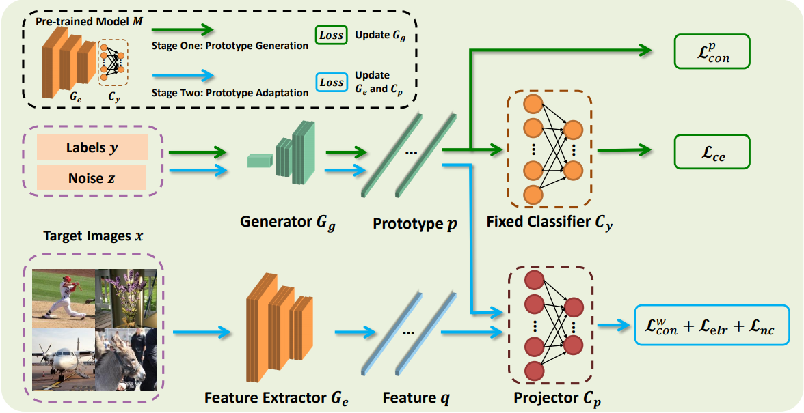

# <center>Source-free Domain Adaptation via Avatar Prototype Generation and Adaptation</center>
This repository provides the official implementation for "**Source-free Domain Adaptation via Avatar Prototype Generation and Adaptation**". (IJCAI2021)

# Paper
[Source-free Domain Adaptation via Avatar Prototype Generation and Adaptation](...)

To handle source-free domain adaptation task, we propose a Contrastive Prototype Generation and Adaptation (CPGA) method. Specifically, CPGA consists of two stage: (1) **Prototype generation**: under the guidance of the fixed classifier, a generator $G_{g}$ is trained to generate avatar feature prototypes via $\mathcal{L}_{ce}$ and $\mathcal{L}_{con}^{p}$. (2) **Protype adaptation**: in each training batch, we use the learned prototype generator to generate one prototype for each class. Based on the generated prototypes and pseudo labels obtained by clustering, we align each pseudo-labeled target feature to the corresponding class prototype by training a domain-invariant feature extractor via $\mathcal{L}_{con}^{w}$, $\mathcal{L}_{elr}$ and $\mathcal{L}_{nc}$. Note that the classifier $C_{y}$ is fixed during the whole training phase.

# Getting Started
## Installation
1. Clone this repository:
```
git clone https://github.com/SCUT-AILab/CPGA.git
cd CPGA
```

2. Install pytorch and other dependencies.
## Data Preparation
- The `.pkl` files of data list and its corresponding labels have been put in the directory `./data`.

<!-- - Download the Pneumonia and COVID-19 dataset and put the data in this repo.
    - Link: [datasets](https://drive.google.com/open?id=1FcXIYJBtfvc1dN54R4cad9cuKVzS8WOb) -->
- Please manually download the [VisDA-C](https://github.com/VisionLearningGroup/taskcv-2017-public/tree/master/classification) benchmark from the official websites.

## Training
- First, to obtain the pre-trained model on the source domain:
```
python train_source --gpu 0 --data_root ./dataset/VISDA-C/train --label_file ./data/visda_synthesis_9_1_split.pkl
```

- Second, to train CPGA on the target domain:
```
python main --gpu 0,1 --max_epoch --source_model_path ./model_source/20201025-1042-synthesis_resnet101_best.pkl --data_path ./dataset/VISDA-C/validation --label_file ./data/visda_real_train.pkl
```


## Testing 
To test CPGA on the target domain using the trained model (please assign a trained model path)
```
python test --gpu 0 --model_path ./model_VISDA-C --data_path ./dataset/VISDA-C/validation --label_file ./data/visda_real_train.pkl
```
<!-- 提供模型 -->

# Citation
If you find our work useful in your research, please cite the following paper:
```
@inproceedings{Qiu2021CPGA,
  title={Source-free Domain Adaptation via Avatar Prototype Generation and Adaptation},
  author={Zhen Qiu and Yifan Zhang and Hongbin Lin and Shuaicheng Niu and Yanxia Liu and Qing Du and Mingkui Tan},
  booktitle={International Joint Conference on Artificial Intelligence},
  year={2021}
}
```
